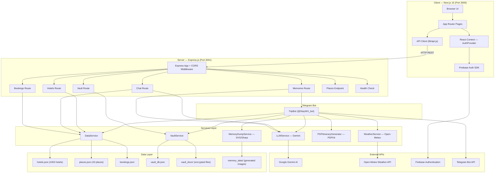
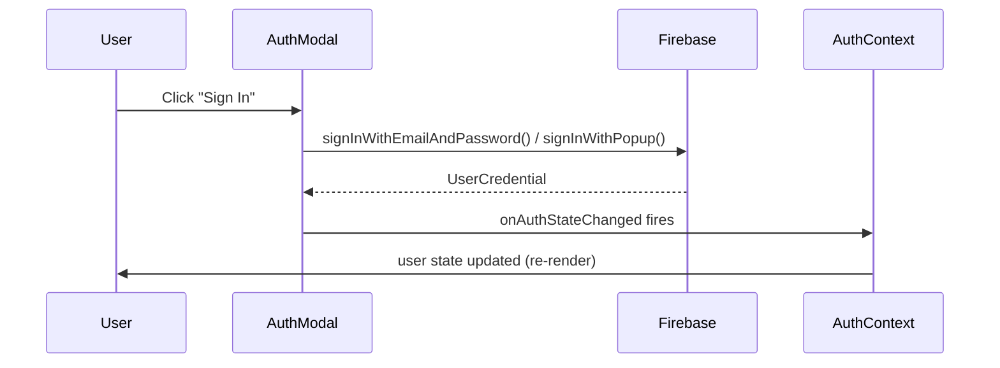
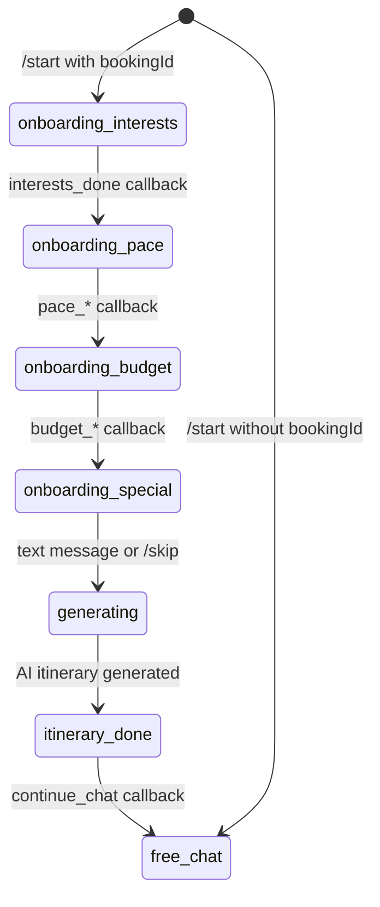
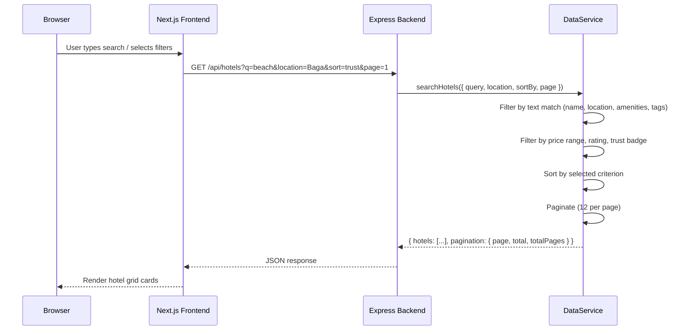
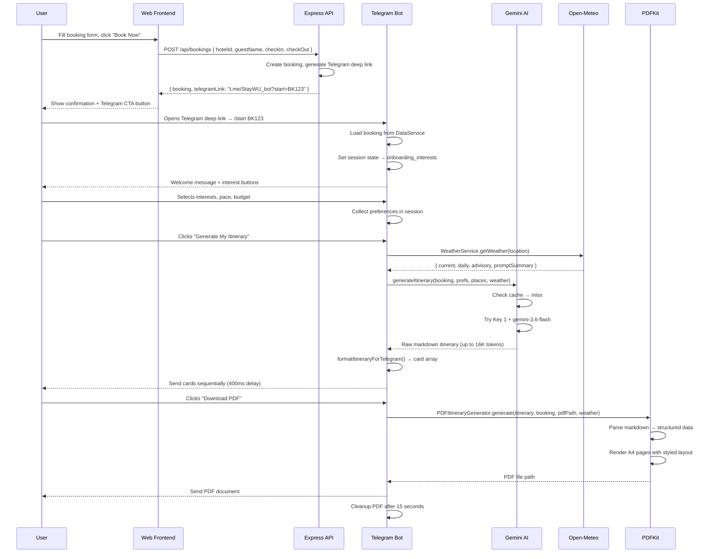
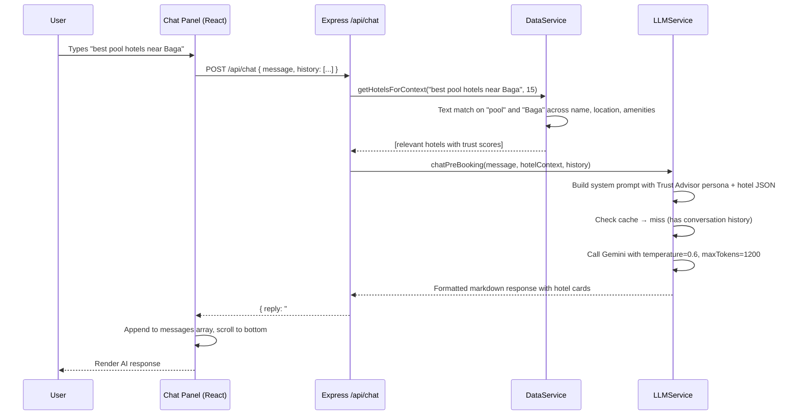
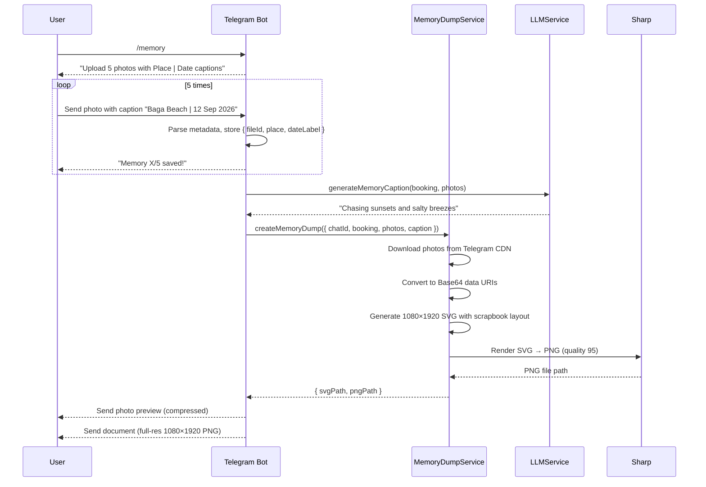

# StayWU — Complete Technical Deep-Dive & Analysis

> **Project:** StayWU — Goa Hotel Trust & Discovery + AI Trip Concierge
> **Repository:** [pranavss73/StayWU](https://github.com/pranavss73/StayWU)
> **Analysis Date:** 21 September 2026
> **Total Source Files Analyzed:** 35+ files across client, server, bot, data pipeline, and deployment configs

---

## Table of Contents

1. [High-Level Architecture](#1-high-level-architecture)
2. [Technology Stack Breakdown](#2-technology-stack-breakdown)
3. [Project Structure & File Map](#3-project-structure--file-map)
4. [Frontend Deep-Dive (Client)](#4-frontend-deep-dive-client)
5. [Backend Deep-Dive (Server)](#5-backend-deep-dive-server)
6. [Telegram Bot Deep-Dive](#6-telegram-bot-deep-dive)
7. [AI / LLM Integration](#7-ai--llm-integration)
8. [Data Pipeline & Processing](#8-data-pipeline--processing)
9. [Document Vault System](#9-document-vault-system)
10. [Weather Integration](#10-weather-integration)
11. [PDF Generation Engine](#11-pdf-generation-engine)
12. [Memory Dump System](#12-memory-dump-system)
13. [Authentication & Security](#13-authentication--security)
14. [Detailed Data Flow Diagrams](#14-detailed-data-flow-diagrams)
15. [API Reference](#15-api-reference)
16. [Deployment Architecture](#16-deployment-architecture)
17. [Optimizations & Improvements](#17-optimizations--improvements)

---

## 1. High-Level Architecture



**Architecture Style:** Monorepo with a decoupled client-server pattern. The frontend and backend are independently deployable. The Telegram bot is co-hosted with the backend as a long-running polling daemon.

---

## 2. Technology Stack Breakdown

### 2.1 Frontend Technologies

| Technology | Version | Purpose | File(s) |
|:---|:---|:---|:---|
| **Next.js** | 16.3.5 | React meta-framework with App Router, SSR/SSG, file-based routing | [package.json](file:///p:/college/projects/Geek2Code/StayWU/client/package.json) |
| **React** | 19.2.8 | UI component library, hooks-based state management | All `.js` files in `client/app/` |
| **React DOM** | 19.2.8 | Browser DOM rendering for React | Auto-included with React |
| **Firebase** | 12.19.0 | Authentication (Google Sign-In, Email/Password, Password Reset) | [firebase.js](file:///p:/college/projects/Geek2Code/StayWU/client/lib/firebase.js), [AuthContext.js](file:///p:/college/projects/Geek2Code/StayWU/client/context/AuthContext.js) |
| **Lucide React** | 1.45.0 | SVG icon library (44+ icons imported across the app) | [page.js](file:///p:/college/projects/Geek2Code/StayWU/client/app/page.js) |
| **Vanilla CSS** | — | ~4,800-line handcrafted design system with CSS custom properties | [globals.css](file:///p:/college/projects/Geek2Code/StayWU/client/app/globals.css) (95 KB) |
| **Google Fonts** | — | Outfit (display headings) + Inter (body text) | Imported in `globals.css` line 6 |
| **ESLint** | 9.x | Code linting with `eslint-config-next` | [eslint.config.mjs](file:///p:/college/projects/Geek2Code/StayWU/client/eslint.config.mjs) |

**How Next.js App Router Works Here:**
- Uses the `/app` directory convention (not the legacy `/pages`).
- Each folder under `app/` with a `page.js` creates a route automatically:
  - `/` → `app/page.js` (main hotel discovery + chatbot page, **56 KB, 1476 lines**)
  - `/login` → `app/login/page.js` (login page)
  - `/profile` → `app/profile/page.js` (user profile + bookings dashboard)
  - `/vault/access` → `app/vault/access/page.js` (QR-accessed vault PIN entry)
  - `/share/access` → `app/share/access/page.js` (temporary share viewer)
  - `/documents` → `app/documents/page.js` (full document vault dashboard, **78 KB**)
- `app/layout.js` wraps all pages with the `<AuthProvider>` context and global CSS.
- `app/api/` contains Next.js API route proxies for `bookings`, `chat`, `health`, `hotels`, `places` — these proxy requests to the Express backend.

---

### 2.2 Backend Technologies

| Technology | Version | Purpose | File(s) |
|:---|:---|:---|:---|
| **Node.js** | 18+ | JavaScript runtime | All server code |
| **Express.js** | 4.21.0 | HTTP server framework, middleware, routing | [index.js](file:///p:/college/projects/Geek2Code/StayWU/server/index.js) |
| **CORS** | 2.8.5 | Cross-Origin Resource Sharing middleware | [index.js](file:///p:/college/projects/Geek2Code/StayWU/server/index.js#L24-L30) |
| **dotenv** | 16.4.7 | Environment variable loading from `.env` files | [index.js](file:///p:/college/projects/Geek2Code/StayWU/server/index.js#L2-L4) |
| **@google/generative-ai** | 0.24.0 | Google Gemini SDK for AI text generation | [llm.js](file:///p:/college/projects/Geek2Code/StayWU/server/services/llm.js) |
| **node-telegram-bot-api** | 0.66.0 | Telegram Bot API wrapper (polling mode) | [telegram.js](file:///p:/college/projects/Geek2Code/StayWU/server/bot/telegram.js) |
| **PDFKit** | 0.15.0 | Programmatic PDF document generation | [pdfGenerator.js](file:///p:/college/projects/Geek2Code/StayWU/server/services/pdfGenerator.js) |
| **QRCode** | 1.5.4 | QR code generation as Data URLs (PNG Base64) | [vaultService.js](file:///p:/college/projects/Geek2Code/StayWU/server/services/vaultService.js) |
| **Sharp** | 0.35.4 | High-performance SVG → PNG rasterization for Memory Dumps | [memoryDump.js](file:///p:/college/projects/Geek2Code/StayWU/server/services/memoryDump.js) |
| **Multer** | 2.4.0 | Multipart form-data file upload middleware (memory storage) | [vault.js route](file:///p:/college/projects/Geek2Code/StayWU/server/routes/vault.js#L7-L11) |
| **crypto** (builtin) | — | SHA-256 cache hashing, scrypt PIN hashing, secure random tokens | [llm.js](file:///p:/college/projects/Geek2Code/StayWU/server/services/llm.js), [vaultService.js](file:///p:/college/projects/Geek2Code/StayWU/server/services/vaultService.js) |

---

### 2.3 External APIs & Services

| Service | Authentication | Purpose |
|:---|:---|:---|
| **Google Gemini AI** | API Key (primary + backup) | LLM for itinerary generation, chatbot Q&A, memory captions, vibe summaries |
| **Open-Meteo** | None (free, keyless) | Real-time weather data and 7-day forecasts for Goa regions |
| **Firebase Auth** | Firebase project config (client-side) | User authentication: Google Sign-In, email/password, password reset |
| **Telegram Bot API** | Bot Token from @BotFather | Trip concierge bot: commands, inline keyboards, photo handling, document delivery |

---

### 2.4 Development & Build Tools

| Tool | Purpose |
|:---|:---|
| **concurrently** (1.0.0) | Runs server & client dev servers simultaneously via `npm run dev` |
| **Node.js `--watch`** | Built-in file watching for server hot-reload (no nodemon needed) |
| **Next.js Turbopack** | Fast dev bundler (configured in [next.config.mjs](file:///p:/college/projects/Geek2Code/StayWU/client/next.config.mjs)) |
| **start.bat** | Windows one-click launcher script |
| **Render** | Backend deployment platform (via [render.yaml](file:///p:/college/projects/Geek2Code/StayWU/server/render.yaml)) |
| **Vercel** | Frontend deployment platform (automatic Next.js optimization) |

---

## 3. Project Structure & File Map

```
StayWU/
├── package.json                    # Root monorepo scripts (concurrently)
├── start.bat                       # Windows launcher
├── .gitignore                      # Comprehensive ignore rules
├── README.md                       # Project documentation
├── DEPLOYMENT_GUIDE.md             # Production deployment guide
│
├── data/                           # Raw & processed datasets
│   ├── GoaHotels_Info.csv          # Source CSV (~511 KB, raw hotel data)
│   ├── recommender_data.csv        # Source CSV for tourist places
│   ├── process-data.js             # ETL pipeline: CSV → JSON
│   ├── hotels.json                 # Processed output (2403 hotels, 1.5 MB)
│   ├── hotels-summary.json         # Compact top-100 for LLM context
│   └── places.json                 # 43 tourist attractions
│
├── demo_images/                    # 5+ curated Goa photos for demo Memory Dumps
│
├── client/                         # Next.js 16 Frontend
│   ├── package.json
│   ├── next.config.mjs             # Turbopack config
│   ├── app/
│   │   ├── layout.js               # Root layout (AuthProvider wrapper)
│   │   ├── page.js                 # Main page (56 KB) — Hotel grid + Chatbot
│   │   ├── globals.css             # Design system (95 KB, 4798 lines)
│   │   ├── page.module.css         # Page-specific styles
│   │   ├── login/page.js           # Login page
│   │   ├── profile/page.js         # User profile & bookings
│   │   ├── vault/access/page.js    # QR-based vault access
│   │   ├── share/access/page.js    # Temporary share viewer
│   │   ├── documents/page.js       # Full vault dashboard (78 KB)
│   │   └── api/                    # Next.js API route proxies
│   │       ├── bookings/
│   │       ├── chat/
│   │       ├── health/
│   │       ├── hotels/
│   │       └── places/
│   ├── components/
│   │   └── AuthModal.js            # Sign-in/Sign-up/Forgot-password modal
│   ├── context/
│   │   └── AuthContext.js          # Firebase auth state provider
│   ├── lib/
│   │   ├── api.js                  # Backend URL resolver
│   │   └── firebase.js             # Firebase SDK initialization
│   └── public/                     # Static assets (favicon, images)
│
├── server/                         # Express.js Backend
│   ├── package.json
│   ├── index.js                    # Server entry point — wiring
│   ├── render.yaml                 # Render.com deployment config
│   ├── Procfile                    # Heroku-style process file
│   ├── .env / .env.example         # Environment variables
│   │
│   ├── bot/
│   │   └── telegram.js             # Telegram TripBot (1346 lines, 54 KB)
│   │
│   ├── routes/
│   │   ├── hotels.js               # GET /api/hotels, /api/hotels/:id
│   │   ├── chat.js                 # POST /api/chat (web chatbot)
│   │   ├── bookings.js             # POST/GET /api/bookings
│   │   ├── vault.js                # Full vault CRUD + sharing + QR
│   │   └── memories.js             # Memory dump API + demo mode
│   │
│   ├── services/
│   │   ├── data.js                 # DataService: hotel/place/booking CRUD
│   │   ├── llm.js                  # LLMService: Gemini with failover + cache
│   │   ├── weather.js              # WeatherService: Open-Meteo integration
│   │   ├── pdfGenerator.js         # PDFItineraryGenerator: A4 luxury PDFs
│   │   ├── vaultService.js         # VaultService: document vault + security
│   │   └── memoryDump.js           # MemoryDumpService: SVG scrapbooks
│   │
│   ├── data/
│   │   ├── bookings.json           # Persistent booking store
│   │   └── vault_db.json           # Vault database (PINs, docs, shares, logs)
│   │
│   ├── storage/
│   │   └── vault_docs/             # Physical document file storage
│   │
│   ├── memory_data/                # Generated memory dump images per user
│   └── temp/                       # Ephemeral PDF files (auto-cleaned)
```

---

## 4. Frontend Deep-Dive (Client)

### 4.1 Design System ([globals.css](file:///p:/college/projects/Geek2Code/StayWU/client/app/globals.css))

The CSS design system is a **4,798-line, 95 KB** hand-crafted stylesheet. It defines:

- **Color Palette:** An "Architectural Obsidian" dark theme with luxury gold accents (`#e2b774`), trust indicators (emerald for trusted `#10b981`, amber for caution `#f59e0b`, rose for risky `#f43f5e`).
- **CSS Custom Properties (Variables):** ~60+ variables covering backgrounds, accents, borders, typography, geometry (border radii), shadows, and transitions.
- **Typography:** Dual-font system — `Outfit` for display headings, `Inter` for body text.
- **Components:** Fully styled hotel cards, trust badges, chat panels, booking flows, modals, skeleton loaders, filter bars, pagination, floating action buttons, vault UI, and more.
- **Responsive Design:** Media queries for mobile, tablet, and desktop breakpoints.
- **Micro-Animations:** Pulse dots, spin icons, fade-ins, hover transforms, and gradient animations.

### 4.2 Main Page ([page.js](file:///p:/college/projects/Geek2Code/StayWU/client/app/page.js) — 1,476 lines)

This single-page application contains multiple views managed by React state:

1. **TopTicker** — Live status bar showing weather, audit count, vault status, bot status.
2. **NavbarUser** — Auth controls: sign-in button or user dropdown with logout.
3. **Hero Section** — Landing with CTA buttons for hotel discovery, vault, and Telegram bot.
4. **Hotel Discovery Grid** — Fetches from `GET /api/hotels` with filters (search, location, price range, rating, trust badge, sort).
5. **Hotel Detail Modal** — Full hotel view with trust score meter, amenities, neighborhood vibe, scam flags, review sentiment, and booking form.
6. **Booking Flow** — Multi-step: guest details → confirmation → Telegram deep link.
7. **AI Chat Panel** — Floating chatbot powered by `POST /api/chat`. Maintains conversation history in React state.
8. **Comparison Tool** — Side-by-side hotel comparison.

### 4.3 Authentication Flow



- **Firebase Project:** `geek2code-ee7ae` (hardcoded in [firebase.js](file:///p:/college/projects/Geek2Code/StayWU/client/lib/firebase.js#L5-L12))
- **Auth Methods:** Email/Password sign-up, Email/Password sign-in, Google OAuth popup, Password reset email
- **State Management:** React Context (`AuthContext.js`) wraps the entire app. `onAuthStateChanged` listener auto-syncs Firebase auth state.
- **Guard against HMR:** `getApps().length > 0 ? getApp() : initializeApp(firebaseConfig)` prevents duplicate Firebase initialization during Next.js hot-reload.

### 4.4 API Client ([api.js](file:///p:/college/projects/Geek2Code/StayWU/client/lib/api.js))

The `BACKEND_URL` is resolved dynamically:
1. If `NEXT_PUBLIC_API_URL` env var is set → use it (production)
2. If running in browser and hostname is NOT localhost → assume same-origin proxy
3. Otherwise → default to `http://localhost:3001` (development)

All API calls use `fetch()` to `${BACKEND_URL}/api/...`.

### 4.5 Documents/Vault Page ([documents/page.js](file:///p:/college/projects/Geek2Code/StayWU/client/app/documents/page.js) — 78 KB)

The largest client page. Implements:
- Vault PIN setup and entry
- Document upload (PDF, JPG, PNG via Multer)
- Document listing, viewing, downloading, deleting
- Temporary share QR creation with duration selection (5/15/60 min)
- Share management (active shares, revoke)
- Audit access log viewer
- Telegram account linking code generation

---

## 5. Backend Deep-Dive (Server)

### 5.1 Server Entry Point ([index.js](file:///p:/college/projects/Geek2Code/StayWU/server/index.js))

The entry point follows a clear initialization sequence:

```
1. Load .env                    → dotenv.config()
2. Import Express + CORS        → Express app creation
3. Instantiate Services         → DataService, LLMService, VaultService
4. Initialize Telegram Bot      → TripBot (starts polling)
5. Mount API Routes             → /api/hotels, /api/chat, /api/bookings, /api/vault, /api/memories, /api/places, /api/health
6. Start HTTP Server            → app.listen(PORT, '0.0.0.0')
7. Register Error Handlers      → unhandledRejection, uncaughtException
```

**CORS Configuration:**
- If `CORS_ORIGIN` is `*` → allow all origins (`origin: true`)
- Otherwise → whitelist the specified origin + Vercel domains + localhost

**Allowed Headers:** `Content-Type`, `Authorization`, `x-vault-session-token`, `x-vault-user-id`, `x-bypass-session`

### 5.2 DataService ([data.js](file:///p:/college/projects/Geek2Code/StayWU/server/services/data.js) — 326 lines)

**Responsibilities:**
- Load `hotels.json` (2,403 hotels), `places.json` (43 places), and `hotels-summary.json` into memory at startup.
- Hotel search with multi-field text matching (name, location, area, landmark, amenities, tags), price range filters, rating filter, trust badge filter, multi-sort (price_low, price_high, rating, trust), and pagination.
- Booking CRUD: create, get, list (by userId or email), update.
- Bookings are persisted to `server/data/bookings.json` via synchronous `fs.writeFileSync`.
- Seeds realistic demo bookings on first run if the bookings file is empty.
- Provides `getHotelsForContext(query, limit)` which returns relevant hotels for LLM prompt injection. If fewer than 5 matches, it pads with top-rated hotels.

**Data Storage Pattern:** All data is **in-memory** (loaded from JSON files at startup). Changes to bookings are synchronously written back to disk. This is a "JSON file database" pattern — simple but has limitations (see Optimizations).

### 5.3 Route Layer

Each route file exports a **factory function** that receives service instances as arguments and returns an Express Router:

| Route File | Endpoints | Service Dependencies |
|:---|:---|:---|
| [hotels.js](file:///p:/college/projects/Geek2Code/StayWU/server/routes/hotels.js) | `GET /api/hotels`, `GET /api/hotels/locations`, `GET /api/hotels/:id` | DataService |
| [chat.js](file:///p:/college/projects/Geek2Code/StayWU/server/routes/chat.js) | `POST /api/chat` | DataService, LLMService |
| [bookings.js](file:///p:/college/projects/Geek2Code/StayWU/server/routes/bookings.js) | `POST /api/bookings`, `GET /api/bookings`, `POST /api/bookings/demo`, `GET /api/bookings/:id` | DataService |
| [vault.js](file:///p:/college/projects/Geek2Code/StayWU/server/routes/vault.js) | 16 endpoints for PIN, QR, documents, shares, audit, Telegram linking | VaultService |
| [memories.js](file:///p:/college/projects/Geek2Code/StayWU/server/routes/memories.js) | `GET /api/memories/latest`, `POST /api/memories/demo`, static file serving | TripBot, LLMService |

---

## 6. Telegram Bot Deep-Dive

### 6.1 Overview

The Telegram bot ([telegram.js](file:///p:/college/projects/Geek2Code/StayWU/server/bot/telegram.js) — **1,346 lines, 54 KB**) is the largest single file in the project. It operates via **long-polling** (not webhooks) and implements a complete stateful conversation engine.

### 6.2 Bot Commands

| Command | Description |
|:---|:---|
| `/start [bookingId]` | Entry point. If bookingId provided, loads booking and starts onboarding flow. If `link_CODE` or `vault_CODE`, links Telegram to vault. Otherwise, general welcome. |
| `/document` | Opens the Secure Document Vault menu with inline keyboard buttons |
| `/link <code>` | Links Telegram chat to a StayWU web account using a 6-char alphanumeric code |
| `/plan` | Generates a personalized weather-aware travel itinerary using Gemini AI |
| `/pdf` | Downloads the generated itinerary as a multi-page executive A4 PDF |
| `/memory` | Starts collecting 5 photos for a Trip Memory Dump |
| `/memorynow` | Generates the Memory Dump immediately from collected photos |
| `/demo` | 1-Tap demo mode using pre-loaded images from `demo_images/` |
| `/sos` | Emergency SOS: police, ambulance, hospital, and scam prevention info |
| `/help` | Lists all commands |

### 6.3 Session State Machine

Each Telegram chat has a session object stored in a `Map`:

```javascript
{
  state: 'onboarding_interests' | 'onboarding_pace' | 'onboarding_budget' |
         'onboarding_special' | 'generating' | 'itinerary_done' | 'free_chat',
  booking: { /* hotel booking data with hotelDetails */ },
  preferences: { interests: [], pace: '', budget: '', specialRequests: '' },
  history: [ /* conversation message history for LLM context */ ],
  itinerary: null | 'raw markdown text',
  weather: null | { /* WeatherService data */ },
  memoryPhotos: [],
  memoryCollectionActive: false,
  memoryPendingPhoto: null,
  memoryDumpGenerated: false,
}
```

### 6.4 Onboarding Flow



Each state transition is driven by inline keyboard callback queries or text messages.

### 6.5 Itinerary Formatting Pipeline

Raw AI markdown → `formatItineraryForTelegram()` → array of card messages → sent sequentially with 400ms delays.

The formatter creates:
1. **Intro Overview Card** — Hotel, dates, pace, budget
2. **Live Weather Card** — Current conditions + 5-day forecast
3. **Day Cards** — Each day parsed into period sections (Morning/Afternoon/Evening) with time pills and dining badges
4. **Budget Breakdown Card** — Categorized expense table

### 6.6 Memory Timer

A `setInterval` runs every 5 minutes (`checkCompletedMemoryDumps`) to auto-generate memory dumps for trips that have passed their checkout date. The timer is `unref()`-ed so it doesn't prevent Node.js from exiting.

---

## 7. AI / LLM Integration

### 7.1 LLMService Architecture ([llm.js](file:///p:/college/projects/Geek2Code/StayWU/server/services/llm.js) — 497 lines)

The LLM service implements a **resilient, multi-key, multi-model execution engine**:

```
Request → Cache Check → Key 1 + Model 1 → Key 1 + Model 2 → Key 1 + Model 3 →
                         Key 2 + Model 1 → Key 2 + Model 2 → Key 2 + Model 3 →
                         Emergency Fallback
```

**Model Priority Cascade:**
1. `gemini-3.6-flash` (fastest modern model)
2. `gemini-3.5-flash-lite` (lighter fallback)
3. `gemini-2.5-flash` (older stable model)

**Dual-Key Failover:**
- Accepts `GEMINI_API_KEY` (primary) and `GEMINI_API_KEY_BACKUP`
- On `429 Too Many Requests` / `QuotaExceeded` / `ResourceExhausted`, immediately switches to the backup key
- Tracks `currentKeyIndex` so subsequent requests start with the last working key

**In-Memory Cache:**
- Uses a `Map` with SHA-256 hash keys (16-char truncated)
- Cache key format: `prefix:hash` (e.g., `prebooking:a1b2c3d4e5f6g7h8`)
- **TTL:** 1 hour
- **Max Size:** 200 entries with LRU eviction (delete oldest key on overflow)
- Only caches first-message responses (not mid-conversation to avoid stale context)

**Backoff:** 250ms delay between retries.

### 7.2 LLM Use Cases

| Method | Use Case | Temperature | Max Tokens | Caching |
|:---|:---|:---|:---|:---|
| `chatPreBooking()` | Web chatbot — hotel trust advisor | 0.6 | 1,200 | First message only |
| `generateItinerary()` | Multi-day travel itinerary | 0.6 | 16,384 | Yes |
| `chatTripAssistant()` | Telegram conversational Q&A | 0.6 | 1,200 | First message only |
| `generateMemoryCaption()` | Short social-media caption | 0.8 | 40 | No |
| `generateVibeSummary()` | Hotel neighborhood vibe one-liner | 0.4 | 100 | No |

### 7.3 System Prompts

Each LLM method uses a carefully crafted system prompt that includes:
- **Role definition** (e.g., "StayWU's Trust Advisor")
- **Behavioral rules** (stay-focused on hotels, anchoring to user's hotel)
- **Trust verification architecture** (4-pillar system: host ID audit, price anomaly detection, review NLP, trust index scoring)
- **Formatted output templates** (markdown hotel cards with emojis)
- **Injected context data** (hotel catalog JSON, places JSON, weather data, conversation history)

### 7.4 Emergency Fallback

If ALL Gemini API keys and models fail, `generateEmergencyItinerary()` returns a **hardcoded structured itinerary** with proper markdown formatting, so the demo never crashes.

---

## 8. Data Pipeline & Processing

### 8.1 ETL Script ([process-data.js](file:///p:/college/projects/Geek2Code/StayWU/data/process-data.js) — 315 lines)

A Node.js script that transforms raw CSV hotel data into structured JSON:

**Input:**
- `GoaHotels_Info.csv` (~511 KB) — Raw hotel data with columns: `hotel_name`, `location`, `ratings`, `price`, `info`, `tag`, `landmark`, `description`, `accessibility`, `occupancy_details`
- `recommender_data.csv` (~16 KB) — Tourist attraction data

**Processing Pipeline:**

```
1. Custom CSV Parser         → Handles quoted fields, commas in values
2. Price Parser              → "₹6,192 per night" → 6192 (integer)
3. Amenities Parser          → "['Gym', 'Pool']" → ["Gym", "Pool"]
4. Tags Parser               → "CoupleFriendlyFreeCancellation" → ["Couple Friendly", "Free Cancellation"]
5. Area Mapping              → Location string → { area: "North Goa", vibe: "..." }
6. Trust Score Algorithm     → Multi-factor scoring (0-100)
7. Scam Flag Detection       → Rule-based warnings
8. Output Writing            → hotels.json, places.json, hotels-summary.json
```

### 8.2 Trust Score Algorithm

```javascript
Base Score = 50

+ (rating / 5) × 30          // Rating contribution (0-30 points)
+ 5                           // Has landmark info
+ 5                           // Has description
+ 5                           // Has amenities
+ 5                           // Price in reasonable range (₹500-25,000)
- 15                          // Price suspiciously low (<₹300)

Trust Badge:
  85-100 → "trusted"
  60-84  → "verified"
  40-59  → "caution"
  <40    → "risky"
```

### 8.3 Scam Flag Rules

- Price below ₹300 → "Suspiciously low price"
- No landmark reference → "No landmark reference"
- No detailed description → "No detailed description"
- Rating > 4.8 but zero amenities → "High rating but no amenity details"

---

## 9. Document Vault System

### 9.1 Architecture ([vaultService.js](file:///p:/college/projects/Geek2Code/StayWU/server/services/vaultService.js) — 917 lines)

The Document Vault is a **zero-trust, PIN-protected travel document storage system** with QR-based access and temporary sharing.

### 9.2 Security Model

| Layer | Implementation |
|:---|:---|
| **PIN Hashing** | `crypto.scryptSync(pin, salt, 64)` — 64-byte derived key with random 16-byte salt |
| **PIN Comparison** | `crypto.timingSafeEqual()` — constant-time comparison prevents timing attacks |
| **Brute Force Protection** | 5 failed attempts → 5-minute lockout |
| **Session Tokens** | `crypto.randomBytes(32).toString('hex')` — 256-bit cryptographically secure tokens |
| **Session Expiry** | 15-minute TTL for authenticated sessions |
| **File Storage** | Random UUID filenames (`crypto.randomBytes(16).toString('hex') + ext`), stored outside public directories |
| **Magic Byte Validation** | Verifies file headers: PDF (`%PDF`), PNG (89 50 4E 47), JPEG (FF D8 FF) |
| **MIME Type Validation** | Allowlist: `application/pdf`, `image/jpeg`, `image/png` |
| **File Size Limit** | 10 MB max (enforced both in Multer and service layer) |
| **IDOR Protection** | Document access always verifies `doc.userId === requestingUserId` |
| **Share Token Security** | 256-bit opaque tokens, time-limited (5/15/60 min), revocable |
| **QR Codes** | Contain only opaque tokens, no PII or direct file URLs |
| **Audit Logging** | Every action logged with timestamp, userId, action, status, IP (max 200 entries) |

### 9.3 Vault Data Flow

````mermaid
sequenceDiagram
    participant User
    participant Frontend
    participant VaultRoute
    participant VaultService
    participant FileSystem

    User->>Frontend: Set PIN (6 digits)
    Frontend->>VaultRoute: POST /api/vault/pin/setup
    VaultRoute->>VaultService: setupPin(userId, pin)
    VaultService->>VaultService: Generate random salt
    VaultService->>VaultService: scrypt(pin, salt, 64) → hash
    VaultService->>FileSystem: Save to vault_db.json
    VaultService-->>VaultRoute: { success: true }

    User->>Frontend: Upload document
    Frontend->>VaultRoute: POST /api/vault/documents/upload (multipart)
    VaultRoute->>VaultService: saveUploadedDocument()
    VaultService->>VaultService: Validate extension, MIME, magic bytes, size
    VaultService->>VaultService: Generate random filename
    VaultService->>FileSystem: Write file to vault_docs/
    VaultService->>FileSystem: Update vault_db.json

    User->>Frontend: Create temporary share
    Frontend->>VaultRoute: POST /api/vault/share/create
    VaultService->>VaultService: Generate 256-bit share token
    VaultService->>VaultService: Generate QR code (qrcode.toDataURL)
    VaultService-->>Frontend: { token, qrDataUrl, expiresAt }

    Note over User: Recipient scans QR code
    User->>Frontend: GET /share/access?token=...
    Frontend->>VaultRoute: GET /api/vault/share/:token
    VaultService->>VaultService: Validate token, check expiry
    VaultService-->>Frontend: { documents: [...] }
````

### 9.4 Telegram ↔ Vault Linking

1. User clicks "Link Telegram" on the web vault
2. Backend generates a 6-character alphanumeric code (10-min expiry)
3. User sends `/link <CODE>` in Telegram
4. Bot verifies the code and creates a bidirectional mapping: `chatId ↔ userId`
5. After linking, the bot's `/document` command provides authenticated vault access URLs

---

## 10. Weather Integration

### 10.1 WeatherService ([weather.js](file:///p:/college/projects/Geek2Code/StayWU/server/services/weather.js) — 177 lines)

**API:** Open-Meteo (completely free, no API key needed)

**Location Resolution:**
- Keyword matching against 30+ Goa locations
- North Goa: lat 15.5432, lon 73.7554
- South Goa: lat 15.2736, lon 73.9582
- Default/Central: lat 15.4989, lon 73.8278

**Data Fetched:**
- Current: temperature, apparent temp, humidity, precipitation, weather code, wind speed
- Daily (7 days): max/min temp, precipitation probability, UV index, weather code

**WMO Weather Code Translation:**
- Maps 20+ numeric WMO codes to human-readable labels, emojis, ASCII text, and rain boolean
- Example: Code 65 → "Heavy Rain" 🌧️

**Advisory Generation:**
- ≥3 rainy days → monsoon advisory
- 1-2 rainy days → light rain advisory
- 0 rainy days → clear skies advisory

**Fallback:** If the API is unreachable (4.5s timeout), returns hardcoded seasonal Goa weather data.

**LLM Integration:** Generates a `promptSummary` string that is injected directly into the Gemini AI prompt for weather-aware itinerary generation.

---

## 11. PDF Generation Engine

### 11.1 PDFItineraryGenerator ([pdfGenerator.js](file:///p:/college/projects/Geek2Code/StayWU/server/services/pdfGenerator.js) — 624 lines)

Transforms raw AI-generated markdown into a **luxury-styled A4 PDF document** using PDFKit.

**Document Structure:**

```
Page 1:
├── Hero Header (dark banner with brand + title)
├── 4 Metadata Cards (Hotel, Location, Dates, Transport)
├── Weather & Forecast Box (live conditions + advisory)
├── Welcome Paragraph (from AI intro)
└── Day 1 Schedule begins...

Pages 2+:
├── Thin brand header on each page
├── Day Banners (blue rounded rect, white text)
├── Day Theme/Focus badges
├── Period Badges (Morning=sky, Afternoon=sky, Evening=purple, Dining=amber)
├── Time Pills (clock-style, blue bg) and Meal Badges (amber bg)
├── Activity descriptions
├── Estimated Day Cost bars (green bg)
├── Travel Tip callout boxes (amber left border, yellow bg)
└── Budget Breakdown Table (alternating rows, bold total)

Footer:
├── Emergency Contacts Box
├── Brand footer text
└── "Page X of Y" numbering
```

**Key Technical Details:**
- **Character Encoding:** All emojis, smart quotes, and ₹ symbols are sanitized to WinAnsi-compatible ASCII (Helvetica doesn't support Unicode emojis)
- **Markdown Parsing:** Custom parser handles `### Day X:`, `**Focus:**`, `**Morning:**`, time formats (09:00 AM), markdown tables, and budget rows
- **Dynamic Layout:** `ensureSpace(neededHeight)` checks if content fits on the current page, adds a new page if not
- **Buffered Pages:** Uses PDFKit's `bufferPages: true` to add footers with page numbers after the entire document is generated

---

## 12. Memory Dump System

### 12.1 MemoryDumpService ([memoryDump.js](file:///p:/college/projects/Geek2Code/StayWU/server/services/memoryDump.js) — 200 lines)

Creates Instagram/WhatsApp Story-ready scrapbook collages from 5 trip photos.

**Output Format:** 1080 × 1920 pixels (9:16 aspect ratio)

**Process:**
1. Downloads photos from Telegram's CDN (via `bot.getFileLink()`)
2. Reads photos as Base64 data URIs for SVG embedding
3. Generates a fixed-layout SVG template with:
   - Beige paper background (`#f5ead4`)
   - 5 photo slots in a scrapbook arrangement with clip paths and white borders
   - Cursive place names and date labels
   - StayWU branding, stars, decorative curves
   - AI-generated trip caption
   - Circular "STAYWU MEMORIES" stamp
4. Renders SVG → PNG using Sharp (or falls back to ImageMagick or SVG-only)

**Photo Slots Layout:**
```
┌──────────────────────────┐
│ StayWU    | North Goa    │ ← Header
│  Trip Memory Dump        │ ← Title
├──────┬───────────────────┤
│Photo1│                   │
│420×520│   Photo4         │
│      │   445×640         │
├──────┤                   │
│Photo2│                   │
│430×430│                  │
├──────┼───────────────────┤
│Photo3│   Photo5          │
│430×370│  445×500         │
├──────┴───────────────────┤
│ caption & guest name     │ ← Footer
└──────────────────────────┘
```

---

## 13. Authentication & Security

### 13.1 Client-Side (Firebase)

- **Google OAuth 2.0** via `signInWithPopup(auth, googleProvider)`
- **Email/Password** via `createUserWithEmailAndPassword` / `signInWithEmailAndPassword`
- **Password Reset** via `sendPasswordResetEmail`
- **State Persistence:** Firebase handles session persistence automatically
- **HMR Protection:** `getApps().length > 0 ? getApp() : initializeApp(config)`

### 13.2 Server-Side Security

- **No Firebase verification on backend** — The server doesn't verify Firebase tokens. User identity is passed via headers (`x-vault-user-id`) or session tokens. This is a significant security gap (see Optimizations).
- **Vault PIN Security:**
  - scrypt with random salt (cryptographically secure)
  - Timing-safe comparison
  - 5-attempt lockout with 5-minute cooldown
  - 15-minute session tokens
- **File Upload Security:**
  - Extension whitelist (PDF, JPG, JPEG, PNG)
  - MIME type whitelist
  - Magic byte verification (file header validation)
  - 10 MB size limit
  - Randomized server-side filenames
- **CORS:** Configurable origin whitelist
- **Process Error Handling:** Global `unhandledRejection` and `uncaughtException` handlers

---

## 14. Detailed Data Flow Diagrams

### 14.1 Hotel Discovery Flow



### 14.2 Booking → Telegram Itinerary Flow



### 14.3 Web AI Chat Flow



### 14.4 Memory Dump Flow (Telegram)



---

## 15. API Reference

### 15.1 Hotels API

| Method | Endpoint | Query Params | Response |
|:---|:---|:---|:---|
| GET | `/api/hotels` | `q`, `location`, `min_price`, `max_price`, `min_rating`, `trust`, `sort`, `page`, `limit` | `{ hotels: [...], pagination: {...} }` |
| GET | `/api/hotels/locations` | — | `[{ name, area, count }]` |
| GET | `/api/hotels/:id` | — | Hotel object |
| GET | `/api/places` | — | `[{ id, name, visited_from, ... }]` |

### 15.2 Chat API

| Method | Endpoint | Body | Response |
|:---|:---|:---|:---|
| POST | `/api/chat` | `{ message, history: [...] }` | `{ reply: "..." }` |

### 15.3 Bookings API

| Method | Endpoint | Body/Query | Response |
|:---|:---|:---|:---|
| POST | `/api/bookings` | `{ hotelId, guestName, guestEmail, checkIn, checkOut, phoneNumber, userId }` | `{ booking, telegramLink }` |
| GET | `/api/bookings` | `?userId=...&email=...` | `{ bookings: [...] }` |
| POST | `/api/bookings/demo` | `{ userId, guestName, guestEmail }` | `{ booking, telegramLink }` |
| GET | `/api/bookings/:id` | — | Booking object |

### 15.4 Vault API (16 endpoints)

| Method | Endpoint | Purpose |
|:---|:---|:---|
| GET | `/api/vault/status` | Vault status (PIN set, lockout, doc count) |
| POST | `/api/vault/pin/setup` | Set security PIN |
| POST | `/api/vault/pin/verify` | Verify PIN → get session token |
| POST | `/api/vault/pin/change` | Change PIN (old + new) |
| POST | `/api/vault/qr` | Get personal vault QR |
| POST | `/api/vault/qr/regenerate` | Regenerate QR (invalidates old) |
| GET | `/api/vault/access/:token` | Validate QR token |
| POST | `/api/vault/access/:token/unlock` | Enter PIN on QR landing page |
| GET | `/api/vault/documents` | List user's documents (session required) |
| POST | `/api/vault/documents/upload` | Upload document (multipart) |
| GET | `/api/vault/documents/:id/view` | View document inline |
| GET | `/api/vault/documents/:id/download` | Download document |
| DELETE | `/api/vault/documents/:id` | Delete document |
| POST | `/api/vault/share/create` | Create temporary share QR |
| GET | `/api/vault/share/:token` | Access shared documents (for recipient) |
| POST | `/api/vault/share/:token/revoke` | Revoke share |
| GET | `/api/vault/shares/active` | List active shares |
| GET | `/api/vault/audit-log` | View audit access log |
| POST | `/api/vault/telegram/link-code` | Generate Telegram linking code |

### 15.5 Health Check

| Method | Endpoint | Response |
|:---|:---|:---|
| GET | `/api/health` | `{ status: "ok", hotels: 2403, places: 43, bot: true }` |

---

## 16. Deployment Architecture

### 16.1 Production Stack

| Component | Platform | Why |
|:---|:---|:---|
| **Frontend** | Vercel | Edge CDN, automatic Next.js optimization, instant SSL |
| **Backend + Bot** | Render | Continuous Node.js process for Telegram polling, free tier |
| **AI** | Google Gemini | Dual API key failover with in-memory cache |
| **Auth** | Firebase | Google Sign-In, email auth, zero backend setup |
| **Weather** | Open-Meteo | Free, keyless, reliable |

### 16.2 Environment Variables

**Server (.env):**
```env
PORT=3001
GEMINI_API_KEY=...          # Primary Gemini key
GEMINI_API_KEY_BACKUP=...   # Backup Gemini key (auto-failover)
TELEGRAM_BOT_TOKEN=...      # From @BotFather
TELEGRAM_BOT_USERNAME=StayWU_bot
FRONTEND_URL=https://staywu.vercel.app
CORS_ORIGIN=*
```

**Client (.env):**
```env
NEXT_PUBLIC_API_URL=https://staywu-backend.onrender.com
```

### 16.3 Render Configuration ([render.yaml](file:///p:/college/projects/Geek2Code/StayWU/server/render.yaml))

```yaml
services:
  - type: web
    name: staywu-backend
    env: node
    plan: free
    buildCommand: npm install
    startCommand: npm start
```

### 16.4 Alternative: Cloudflare Tunnel

For zero-deployment hackathon demos: `npx cloudflared tunnel --url http://localhost:3000` creates an instant public HTTPS URL.

---

## 17. Optimizations & Improvements

### 🔴 Critical Issues

#### 1. **Firebase Token Verification Missing on Backend**
**Current:** The server trusts `x-vault-user-id` headers without verifying Firebase ID tokens. Any client can impersonate any user.
**Fix:** Use `firebase-admin` SDK on the backend to verify ID tokens:
```javascript
const decodedToken = await admin.auth().verifyIdToken(idToken);
const uid = decodedToken.uid;
```

#### 2. **Synchronous File I/O Blocks Event Loop**
**Current:** `fs.readFileSync` and `fs.writeFileSync` are used throughout DataService and VaultService. Every booking save or vault DB update blocks all concurrent requests.
**Fix:** Use `fs.promises.readFile` / `fs.promises.writeFile` with debounced writes:
```javascript
// Debounce saves to avoid writing on every single change
this._saveTimer = setTimeout(() => fs.promises.writeFile(...), 500);
```

#### 3. **No Rate Limiting on API Endpoints**
**Current:** No rate limiting on any endpoint. The chat API (`POST /api/chat`) calls Gemini for every request.
**Fix:** Add `express-rate-limit`:
```javascript
const rateLimit = require('express-rate-limit');
app.use('/api/chat', rateLimit({ windowMs: 60000, max: 20 }));
app.use('/api/vault/pin/verify', rateLimit({ windowMs: 60000, max: 10 }));
```

#### 4. **Hardcoded Firebase Config in Client**
**Current:** Firebase API key and config are hardcoded in [firebase.js](file:///p:/college/projects/Geek2Code/StayWU/client/lib/firebase.js#L5-L12).
**Fix:** Move to environment variables:
```javascript
const firebaseConfig = {
  apiKey: process.env.NEXT_PUBLIC_FIREBASE_API_KEY,
  authDomain: process.env.NEXT_PUBLIC_FIREBASE_AUTH_DOMAIN,
  // ...
};
```

> [!NOTE]
> Firebase API keys are not secret (they're domain-restricted), but moving to env vars is a best practice for configurability and prevents accidental exposure in forks.

---

### 🟡 Performance Optimizations

#### 5. **JSON File Database → Proper Persistence**
**Current:** All data lives in JSON files loaded into memory. The entire 1.5 MB `hotels.json` and growing `vault_db.json` are rewritten on every change.
**Fix Options:**
- **SQLite** (via `better-sqlite3`): Zero-config embedded database, perfect for this scale
- **PostgreSQL** (if scaling beyond a single server): via Render's free Postgres or Supabase

#### 6. **Massive Single-File Components**
**Current:**
- `client/app/page.js` = **56 KB, 1,476 lines** (hotel grid + detail modal + booking + chatbot)
- `client/app/documents/page.js` = **78 KB** (entire vault dashboard)
- `server/bot/telegram.js` = **54 KB, 1,346 lines** (all bot logic)

**Fix:** Split into focused modules:
```
client/app/page.js → 
  components/HotelGrid.js
  components/HotelDetail.js
  components/BookingFlow.js
  components/ChatPanel.js
  components/TopTicker.js
  components/NavbarUser.js

server/bot/telegram.js →
  bot/handlers/start.js
  bot/handlers/itinerary.js
  bot/handlers/memory.js
  bot/handlers/vault.js
  bot/handlers/freeChat.js
  bot/formatters/telegramCards.js
```

#### 7. **No Input Validation Library**
**Current:** Manual `if (!hotelId || !guestName)` checks scattered across routes.
**Fix:** Use `zod` or `joi` for schema validation:
```javascript
const bookingSchema = z.object({
  hotelId: z.number().positive(),
  guestName: z.string().min(1).max(100),
  checkIn: z.string().date(),
  checkOut: z.string().date(),
});
```

#### 8. **Telegram Bot Polling → Webhooks (Production)**
**Current:** Long-polling (`{ polling: true }`) keeps an open connection. Fine for development but inefficient in production.
**Fix:** Switch to webhooks for Render deployment:
```javascript
bot.setWebHook(`${backendUrl}/api/telegram-webhook`);
app.post('/api/telegram-webhook', (req, res) => {
  bot.processUpdate(req.body);
  res.sendStatus(200);
});
```

#### 9. **Global CSS File is 95 KB**
**Current:** One monolithic `globals.css` file. Browser downloads all 95 KB even for pages that use a fraction of the styles.
**Fix:** 
- Split into component-level CSS modules (`HotelCard.module.css`, `ChatPanel.module.css`)
- Use Next.js CSS Modules for automatic scoping and code-splitting
- Consider CSS-in-JS (styled-components) or CSS nesting for component-level styles

#### 10. **No Caching Headers on Static Data**
**Current:** Hotel data and places data are served fresh on every request despite being static.
**Fix:** Add `Cache-Control` headers:
```javascript
router.get('/locations', (req, res) => {
  res.set('Cache-Control', 'public, max-age=3600'); // 1 hour
  res.json(dataService.getLocations());
});
```

---

### 🟢 Feature & UX Improvements

#### 11. **No Error Boundary on Frontend**
**Fix:** Add a React Error Boundary to prevent white screens:
```javascript
// components/ErrorBoundary.js
'use client';
export default class ErrorBoundary extends React.Component {
  state = { hasError: false };
  static getDerivedStateFromError() { return { hasError: true }; }
  render() {
    if (this.state.hasError) return <FallbackUI />;
    return this.props.children;
  }
}
```

#### 12. **No Loading States for LLM Responses**
**Current:** The chat panel shows a generic loader while waiting for Gemini. Responses can take 3-10 seconds.
**Fix:** Implement streaming responses via Server-Sent Events (SSE):
```javascript
// Server: stream Gemini response token-by-token
const stream = await model.generateContentStream(request);
for await (const chunk of stream) {
  res.write(`data: ${chunk.text()}\n\n`);
}
```

#### 13. **Hotel Images**
**Current:** No hotel images are displayed. The dataset doesn't include image URLs.
**Fix:** Integrate a hotel image API (e.g., Unsplash API for generic location photos, or scrape images from the original data source).

#### 14. **No Accessibility (a11y) Audit**
**Fix:** Add ARIA labels, keyboard navigation, focus management for modals, and screen reader support. The auth modal already has some `aria-label` attributes — extend this pattern.

#### 15. **Test Coverage**
**Current:** Zero automated tests.
**Fix:**
- **Unit tests:** Jest for DataService search/filter logic, trust score algorithm, price parsing
- **API tests:** Supertest for Express route testing
- **E2E tests:** Playwright for booking flow, vault PIN setup

#### 16. **Hardcoded Demo Data**
**Current:** Demo bookings have hardcoded names ("Pranav"), emails, and dates.
**Fix:** Make demo data configurable via environment variables or use the authenticated user's name from Firebase.

#### 17. **Bug: `getActiveShares` References Undefined Variable**
**Current:** In [vaultService.js line 734](file:///p:/college/projects/Geek2Code/StayWU/server/services/vaultService.js#L734), the variable `documentNames` is referenced but was defined as `docNames` on line 726.
```javascript
// Line 726: const docNames = this.db.documents...
// Line 734: documentNames,  // ← BUG: should be docNames
```
**Fix:** Change `documentNames` to `docNames` on line 734.

#### 18. **Weather Data is Static in TopTicker**
**Current:** The top ticker bar shows hardcoded weather: "Panaji 25°C • Tropical Breeze & Passing Showers"
**Fix:** Fetch live weather from the backend's weather endpoint and update the ticker dynamically.

#### 19. **No Booking Cancellation**
**Current:** Bookings can be created but never cancelled or modified (except by manually editing the JSON file).
**Fix:** Add `DELETE /api/bookings/:id` and a cancellation UI in the profile page.

#### 20. **LLM Cache Key Collision Risk**
**Current:** Cache keys use 16-character SHA-256 truncation. While unlikely, this creates a theoretical collision space.
**Fix:** Use the full 32 or 64 character hash, or switch to a proper LRU cache library like `lru-cache` with size-based eviction.

---

> **Summary:** StayWU is a well-architected full-stack travel platform with impressive feature depth (AI itinerary, Telegram bot, document vault, PDF generation, memory dumps, weather integration). The codebase demonstrates strong engineering patterns (dual-key failover, emergency fallbacks, scrapbook SVG generation, trust scoring algorithms). The primary areas for improvement are: backend authentication verification, async file I/O, code splitting for large files, rate limiting, and automated testing.
